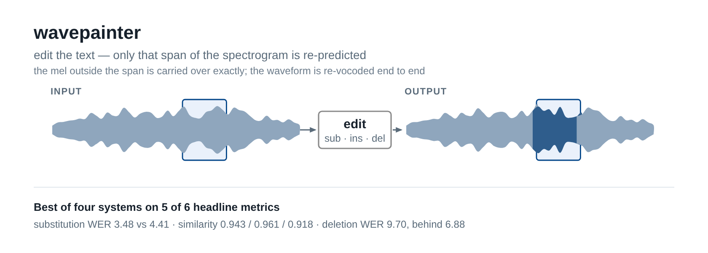

<p align="center">
  <picture>
    <source media="(prefers-color-scheme: dark)" srcset="assets/readme/hero-dark.png">
    
  </picture>
</p>

# wavepainter

*wavepainter: Multimodal LLM-Guided Diffusion for Text-Based Speech Editing*


[](https://huggingface.co/RootAccess4Life/wavepainter)

> 📦 Checkpoints: **[RootAccess4Life/wavepainter](https://huggingface.co/RootAccess4Life/wavepainter)**
> — [phase2-hubert-child](https://huggingface.co/RootAccess4Life/wavepainter/tree/main/phase2-hubert-child)
> is the released model and the artifact of record for every number below &nbsp;·&nbsp;
> [phase1-base](https://huggingface.co/RootAccess4Life/wavepainter/tree/main/phase1-base) &nbsp;·&nbsp;
> [phase2-hubert-a070](https://huggingface.co/RootAccess4Life/wavepainter/tree/main/phase2-hubert-a070) &nbsp;·&nbsp;
> [phase2-hubert-a085](https://huggingface.co/RootAccess4Life/wavepainter/tree/main/phase2-hubert-a085).
> All four are sha256-pinned in `scripts/download_weights.py`; fetch with
> `python scripts/download_weights.py`.

**Edit a word in the transcript; only that span is re-predicted.** Substitution,
insertion and deletion, from one checkpoint and one decode path.

**Substitution WER 3.48 against a previous best of 4.41 · speaker similarity
0.943 / 0.961 / 0.918 against a best baseline of 0.82 · deletion WER 9.70, where
we lose to 6.88.** English `full` split of Ming-Freeform-Audio-Edit
([table](#results)).

```bash
git clone https://github.com/pujariaditya/wavepainter && cd wavepainter
pip install -e . && ./setup.sh
./scripts/demo_edit.sh               # edits one bundled item, writes a wav
```

**What "only that span" means, exactly.** Outside the edit the source
recording's own mel is carried over unchanged — but the whole utterance is then
re-vocoded, so the output matches the source *spectrogram* there, not its
samples. Measured: PESQ 4.090 over the unedited audio, against 4.351 for
copy-synthesis with no edit and 4.644 for identical signals, so the vocoder pass
costs about as much as the edit
([numbers](docs/RESULTS.md#5-full-reference-quality)).

`demo_edit.sh` edits one benchmark item; it is not a general editing CLI and
nothing here takes your own audio. It fetches the sha256-pinned checkpoint and
that item's wav, then verifies its own output is non-empty and differs from the
source. No aligner install is needed — **all 655 forced alignments ship in
`assets/alignments/`**, one per protocol item, and a test fails if any is
missing.

## Results

English `full` split of Ming-Freeform-Audio-Edit. Baselines are
Ren et al. ([arXiv:2602.00560](https://arxiv.org/abs/2602.00560)) Table I, which
re-runs FluentSpeech and VoiceCraft under the same forced-alignment masks. Both
sides score WER with Whisper and similarity with WavLM embeddings on an
identical, fingerprint-verified item set; the exact variants on their side are
unstated, so these are quoted rather than scorer-identical
([detail](docs/RESULTS.md#1-main-comparison)).

| | FluentSpeech | VoiceCraft | Ren et al. | **wavepainter** |
|---|---|---|---|---|
| substitution WER ↓ | 4.65 | 12.73 | 4.41 | **3.479** |
| insertion WER ↓ | 11.91 | 12.94 | 4.97 | **4.400** |
| deletion WER ↓ | 8.78 | 17.88 | **6.88** | 9.697 |
| substitution SIM ↑ | 0.51 | 0.59 | 0.78 | **0.943** |
| insertion SIM ↑ | 0.60 | 0.67 | 0.82 | **0.961** |
| deletion SIM ↑ | 0.52 | 0.62 | 0.78 | **0.918** |

**Phase one earns these comparisons, not phase two.** The phase-1 editor alone
scores 4.019 substitution and 4.465 insertion at the same three similarities, so
it is already ahead of Ren et al. before the second phase runs. Phase two is
worth 0.540 / 0.065 / 0.551 WER on top, which is what the 1 GPU-hour buys — a
real gain on every edit type, and an increment rather than the margin.

**We lose on deletion WER**, to Ren et al. and to FluentSpeech, and that row is
here rather than in a footnote. A ground-truth waveform splice — the deletions
cut from the source audio, no model — scores 7.589, which puts 2.11 of our
2.82-point gap in the model ([details](docs/RESULTS.md#4-deletion-reference)).

Ming-UniAudio ([arXiv:2511.05516](https://arxiv.org/abs/2511.05516)) created the
benchmark, and its figures are deliberately absent: they come from its
no-timestamp free-form protocol, a harder task than the one scored here. That
caveat applies to it alone — the three baselines above all used
forced-alignment masks.

## Reproduce the table

```bash
python scripts/download_weights.py   # ~4.4 GB, sha256-pinned
python scripts/fetch_benchmark.py    # the 655 benchmark items
./scripts/verify_benchmark.sh        # ~50 min on one RTX 8000
```

That scores `phase2-hubert-child` — phase two as trained, and the checkpoint
every number above comes from. Two earlier checkpoints stay published for
anyone who already fetched them: `phase2-hubert-a085` and `phase2-hubert-a070`
are the same phase-two model interpolated back toward phase one. The paper no
longer reports them.

Protocols, alignments and vocabularies ship in `assets/` (6.4 MB); only benchmark
audio and checkpoints are fetched, and no weights or datasets are redistributed.
Re-running phase two costs about **1 GPU-hour**: `./scripts/train_phase2.sh`
fetches the phase-1 base and redoes phase two end to end.

## Where to go next

| | |
|---|---|
| [docs/RESULTS.md](docs/RESULTS.md) | every measured number, with the command that produced it and what is not measured |

There is no hosted CI. Install on a fresh clone with `pip install -e .`. The
paper sources are kept out of this repository and published separately.
`wavepainter.evaluate` requires a CUDA device, so `demo_edit.sh` cannot run on a
CPU-only machine; the script checks its own output instead of announcing
success.

## Citation

See `CITATION.cff`. Please also cite the baseline (Ren et al.,
[arXiv:2602.00560](https://arxiv.org/abs/2602.00560)) and the benchmark
(Ming-UniAudio, [arXiv:2511.05516](https://arxiv.org/abs/2511.05516)).

## Licence

MIT (`LICENSE`). No weights or datasets are redistributed. This repository began
as a fork of FluentEditor, itself a NATSpeech/DiffSinger derivative; every file
that was distinctively FluentEditor's has been reimplemented, verified by
`scripts/check_provenance.py`.
